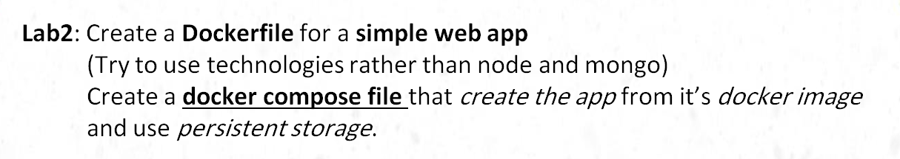
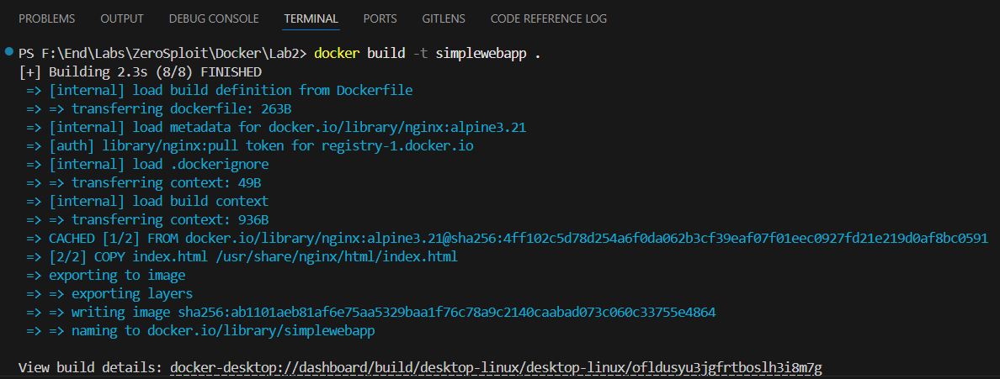
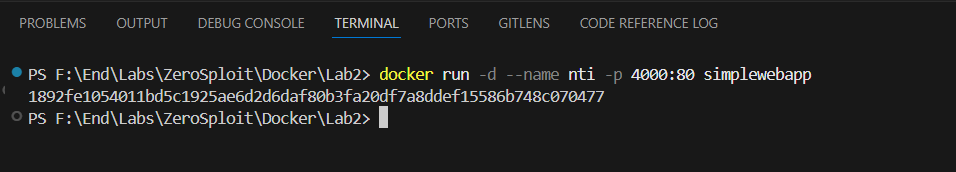
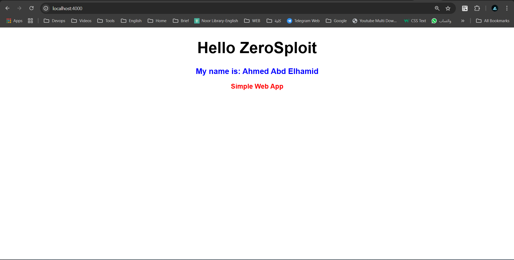
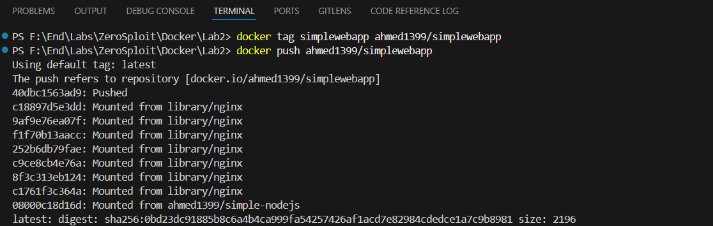
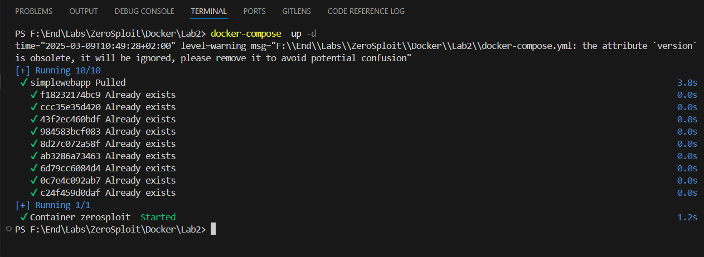

# Lab2


# Build Image & run Container



## Output


# Tag & Push Image
```bash
docker tag simplewebapp ahmed1399/simplewebapp

docker push ahmed1399/simplewebapp
```


# Build docker-compose.yml & run
```bash
docker-compose up -d
```


# Output of Docker Compose


