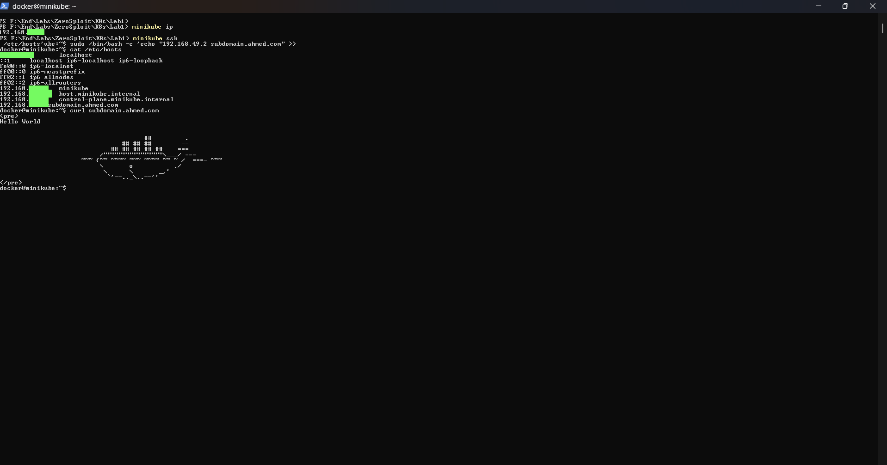

# Lab1


# Step1: Prepare manifest files
```bash
Deployment.yml
Service.yml
Ingress.yml
```
# Step2: Apply manifest files
```bash
kubectl apply -f Deployment.yml
kubectl apply -f Service.yml
kubectl apply -f Ingress.yml


to Enable LoadBalancer on Minikube use  -----> minikube tunnel 
```


# Step3: Add & Acces Domain Name
```bash
# get of Ip Address
minikube ip
minikube ssh
# Install Text Editor
sudo apt update && apt Install nano -y
# Add IP Address & Domain Name
sudo nano /etc/hosts

curl <Your Domain Name>
```
